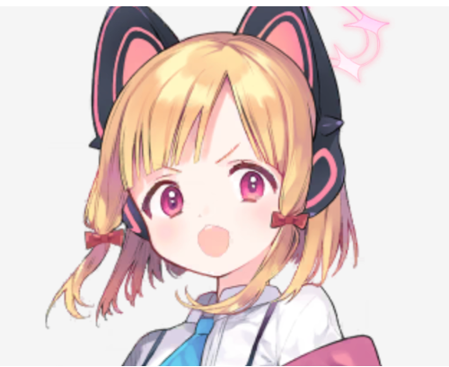
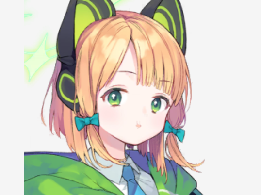
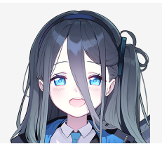

# 🎮 千禧年科技学院 - 游戏开发部
## *Millennium Science School - Game Development Department*

*"用代码创造奇迹，用游戏改变世界！"*

---

## 🌸 欢迎来到千禧年游戏开发部！

<div align="center">

### 🎭 我们的开发团队

<table>
<tr>
  <td align="center">
    
    <br><strong>🎮 花冈柚子 (Yuzu)</strong>
    <br>游戏开发部部长 | 隐居少女
    <br>专精: 游戏策划、系统设计、玩家体验
    <br><em>"虽然害怕交流，但游戏技术一流！"</em>
  </td>
  <td align="center">
    
    <br><strong>📝 才羽桃井 (Momoi)</strong>
    <br>游戏编剧 | 双胞胎姐姐
    <br>专精: 剧情创作、角色设定、世界观构建
    <br><em>"元气满满的故事创作者！"</em>
  </td>
</tr>
<tr>
  <td align="center">
    
    <br><strong>🎨 才羽绿 (Midori)</strong>
    <br>游戏美术 | 双胞胎妹妹
    <br>专精: 角色设计、场景绘制、UI设计
    <br><em>"内向但充满艺术天赋的画师！"</em>
  </td>
  <td align="center">
    
    <br><strong>🤖 天童爱丽丝 (Alice)</strong>
    <br>神秘成员 | AI少女
    <br>专精: 程序开发、算法优化、系统架构
    <br><em>"来历不明的超级程序员！"</em>
  </td>
</tr>
</table>

</div>

---

## 💻 我们的技能树

### 🛠️ **开发工具箱**
- **游戏引擎**: Unity, Unreal Engine, 自制引擎
- **编程语言**: C#, C++, Python, JavaScript
- **美术工具**: Photoshop, Maya, Blender, Live2D
- **版本控制**: Git, Perforce
- **协作平台**: Discord, Notion, Figma

### 🎯 **专业领域**
- **🎪 游戏策划**: 玩法设计、平衡调优、用户体验
- **📚 剧情编写**: 世界观构建、角色塑造、对话系统
- **🎨 美术设计**: 2D/3D美术、动画制作、特效设计
- **⚙️ 程序开发**: 核心逻辑、AI系统、性能优化

---

## 🎓 游戏开发修炼指南

### 📅 **每周训练计划**
- **周一**: 🔥 技术分享会 - 新技术学习与交流
- **周二**: 📝 剧情讨论 - 故事创作与角色设定
- **周三**: 🎨 美术练习 - 绘画技法与设计理论
- **周四**: 💻 编程实战 - 算法学习与代码review
- **周五**: 🎮 游戏测试 - 试玩反馈与优化
- **周末**: 🏆 项目开发 - 实际游戏制作

### 🌟 **学习目标**
- **📱 掌握手机游戏开发基础**
- **🕹️ 学习经典游戏设计理念**
- **🎪 探索创新玩法机制**
- **🏆 准备参与校内游戏大赛**

---

## 🚀 我们的发展计划

### 🌱 **当前状态**
游戏开发部刚刚成立，我们正在：
- 📚 **基础学习阶段** - 每位成员都在提升各自领域的技能
- 🎯 **团队磨合期** - 学习如何协作开发游戏
- 🛠️ **环境搭建中** - 配置开发工具和工作流程
- 💡 **创意酝酿期** - 讨论和规划我们的第一个游戏项目

### 🎯 **短期目标 (1-3个月)**
- 🎮 **完成第一个小游戏Demo** - 简单的益智或休闲游戏
- 📖 **建立开发文档规范** - 统一团队工作流程
- 🤝 **提升团队协作效率** - 熟悉各自的工作风格
- 🎨 **确定美术风格指南** - 为未来项目奠定视觉基础

### 🏆 **长期愿景 (半年以上)**
- 🌟 **发布第一款完整游戏** - 在校内展示我们的成果
- 🏅 **参与基沃托斯游戏大赛** - 与其他学校切磋技艺
- 🎪 **举办游戏开发讲座** - 分享我们的开发经验
- 💫 **建立游戏开发社区** - 吸引更多志同道合的同学

---

## 📂 项目文件结构

```
Game_Development/
├── 📁 Projects/                    # 游戏项目
│   ├── 📁 Demos/                  # 演示项目
│   ├── 📁 Tutorials/              # 学习项目
│   └── 📁 Experiments/            # 实验性项目
├── 📁 Assets/                     # 资源文件
│   ├── 📁 Art/                   # 美术资源
│   ├── 📁 Audio/                 # 音频资源
│   ├── 📁 Scripts/               # 代码脚本
│   └── 📁 Documents/             # 设计文档
├── 📁 Tools/                      # 开发工具
│   ├── 📁 Engines/               # 游戏引擎
│   ├── 📁 Plugins/               # 插件工具
│   └── 📁 Utilities/             # 实用程序
├── 📁 Learning/                   # 学习资料
│   ├── 📁 Tutorials/             # 教程文档
│   ├── 📁 Books/                 # 参考书籍
│   └── 📁 Courses/               # 在线课程
└── 📁 Archive/                    # 历史存档
    ├── 📁 Meeting_Notes/         # 会议记录
    └── 📁 References/            # 参考资料
```

---

## 🎨 部门文化

### 💫 **核心价值观**
- 🌟 **创新至上**: 永远追求新的游戏体验
- 🤝 **团队合作**: 发挥每个人的独特才能
- 📚 **持续学习**: 不断提升技术水平
- 🎮 **玩家优先**: 以玩家体验为设计核心

### 🎪 **部门传统**
- 🍰 **每周聚会**: 分享学习心得和项目进展
- 🎯 **月度挑战**: 小型游戏制作练习
- 🍕 **学习夜宵**: 一起熬夜学习时的温馨时光
- 🎊 **成果展示**: 定期展示我们的学习成果

### 🌈 **成员寄语**
> **柚子**: "虽然我不太善于交流，但希望能通过游戏与大家分享快乐..."
> 
> **桃井**: "让我们一起创造出最棒的故事吧！每个角色都有自己的冒险！"
> 
> **绿**: "我会努力画出大家心中的世界...请多指教..."
> 
> **爱丽丝**: "有趣的数据...这个团队的创造力指数超出了预期参数。"

---

## 🌈 联系我们

想要了解更多关于千禧年游戏开发部的信息？

- 📧 **部门邮箱**: game_dev@millennium.edu
- 💬 **即时通讯**: MomoTalk @GameDevDept
- 🏛️ **活动室**: 千禧年塔楼 42F 游戏开发部
- ⏰ **开放时间**: 平日 16:00-22:00

### 🤝 **加入我们**
如果你也对游戏开发感兴趣，欢迎来找我们！
- 不需要任何基础，我们一起从零开始学习
- 无论是编程、美术、音乐还是策划，都有发挥的空间
- 最重要的是对游戏的热爱和学习的热情！

---

<div align="center">

### 🎮 "虽然刚刚起步，但每一步都充满可能性！" 🎮

**© 2024 千禧年科技学院游戏开发部 | 用游戏连接世界，用创意改变未来**

</div> 